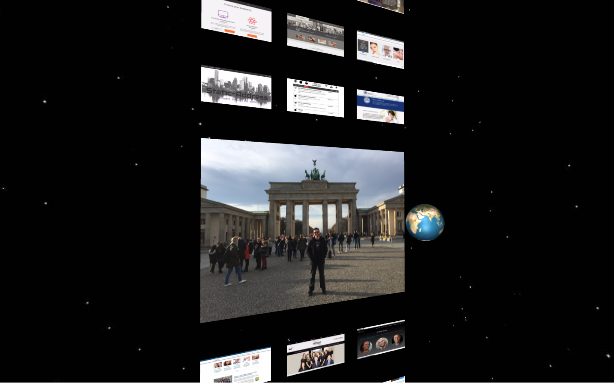
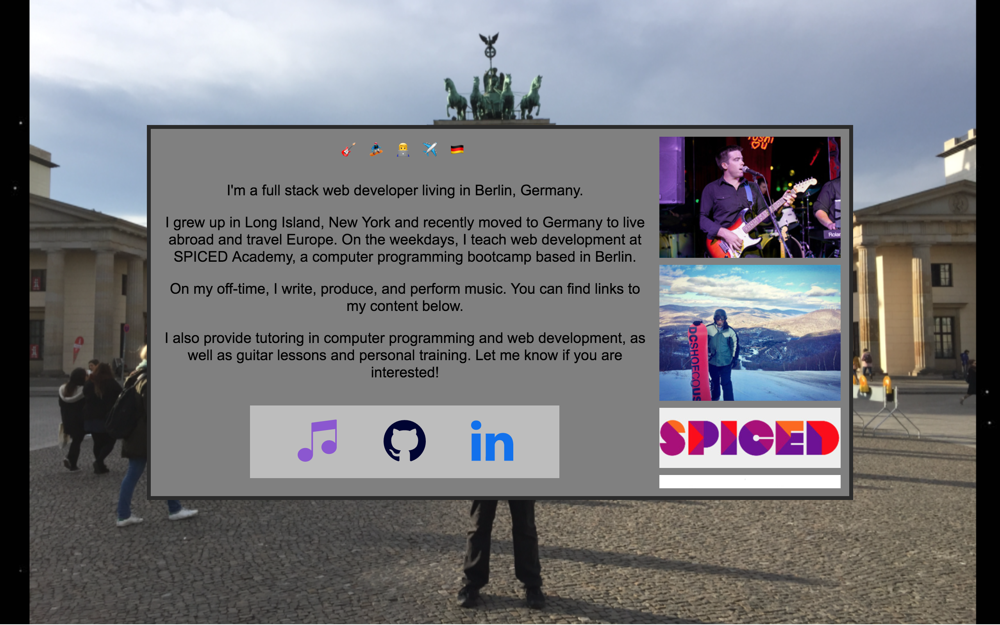

# mattfewer.com - Personal Website

## Link

[mattfewer.com](http://mattfewer.com)

## Overview

This iteration of my website was designed to be an interactive, 3D world in which the user can "fly around" while viewing and interacting with various portfolio pieces.

I challenged my 3D design and development skills with this website.  Amongst the most difficult components to implement included: custom tweening, using multiple renderers in one scene, incorporating templating functionality with Handlebars, and completely controlling the UX in order to avoid crashes.

I'm very happy with how the site came out, and I hope to continually build my website into an even more intriguing 3 dimensional world.

## Author

Matt Fewer ([website](http://mattfewer.com), [github](https://github.com/mattyfew))

## Technology

This application was built with Three.js, Handlebars, Express, & Node.

## Controls

| Key        | Control  |
| ---------- | -------- |
| ↑ or R     | Up       |
| ↓ or F     | Down     |
| ← or A     | Left     |
| → or D     | Right    |
| W or click | Forward  |
| S          | Backward |

## Screenshots

